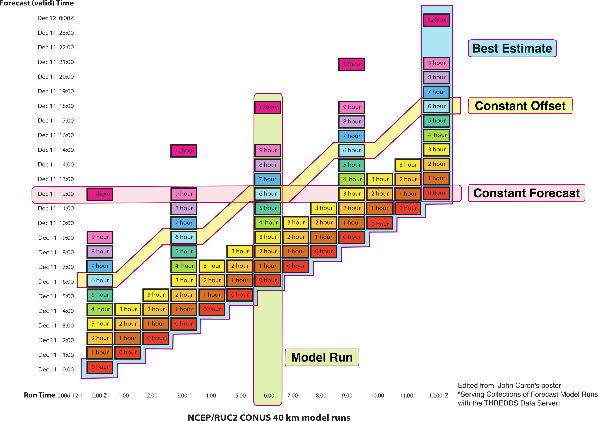

---
jupytext:
  text_representation:
    format_name: myst
kernelspec:
  display_name: Python 3
  name: python
---

# Weather Forecasts

One way to model forecast output is a datacube with four dimensions :

- 2 spatial dimensions `x` and `y`,
- a forecast reference time (or initialization time) commonly `time`[datetime64], and
- a forecast period or "timesteps in to the future" commonly `step`[timedelta64]

There is one ancillary variable: 'valid time' which is the time for which the forecast is made: `valid_time = time + step`

```{note}
Note that not all forecast model runs are run for the same length of time! We could model these missing forecasts as NaN values in the output.
```

There are many ways one might index weather forecast output.
These different ways of constructing views of a forecast data are called "Forecast Model Run Collections" (FMRC).
For reference, see [this classic image](https://www.unidata.ucar.edu/presentations/caron/FmrcPoster.pdf) where the
y-axis is the 'valid time', and the x-axis is the 'forecast reference or initialization time':


- "Model Run" : a single model run.
- "Constant Offset" : all values for a given lead time.
- "Constant Forecast" : all forecasts for a given time in the future.
- "Best Estimate" : A best guess stitching together the analysis or initialization fields for past forecasts with the latest forecast.

## Highlights

All of these patterns are "vectorized indexing", though generating the needed indexers is complicated by missing data.

`ForecastIndex` encapsulates this logic and,

1. Demonstrates how fairly complex indexing patterns can be abstracted away with a custom Index, and
1. Again illustrates the value of a custom Index in persisting "state" or extra metadata (here the type of model used).

## Example

Read an example dataset -- downward short-wave radiation flux from the NOAA's HRRR forecast system ([High Resolution Rapid Refresh](https://rapidrefresh.noaa.gov/hrrr/)).

```{code-cell}
import rolodex.forecast
import xarray as xr

xr.set_options(display_expand_indexes=True, display_expand_data=False)

cube = xr.tutorial.open_dataset("hrrr-cube")
cube
```

### Assigning

To assign we add a new variable: `valid_time = time + step`, "initialization time" + "time steps in to the future".

```{code-cell}
from rolodex.forecast import Model, ForecastIndex

cube.coords["valid_time"] = rolodex.forecast.create_lazy_valid_time_variable(
    reference_time=cube.time, period=cube.step
)
```

With the `valid_time` array, we can illustrate the complex structure of this datacube.

- green box illustrates the bounding box of valid forecast data, any white cells within this box are NaN --- no forecast was generated for that forecast time with that initialization time.
- the horizontal black line "2025-01-02 21:00" has 4 valid forecasts, though the underlying data has 23 data points (mostly NaN).

```{code-cell}
---
tags: [hide-input]
---
import numpy as np
import matplotlib.pyplot as plt
time = "2025-01-02T21:00"

(
    cube.dswrf
    .isel(x=10, y=20)
    .plot(
        x="time",
        y="valid_time",
        cmap="plasma",
        robust=True,
        # edgecolors="#fefefe",
        # linewidths=0.003,
        aspect=2,
        size=5,
    )
)
plt.axhline(np.datetime64(time), color="k")
plt.plot(
    cube.time.data[[0, -1, -1, 0, 0]],
    cube.valid_time.data[
        [0, -1, -1, 0, 0],
        [0, 0, -1, -1, 0],
    ],
    color="#32CD32",
    lw=2,
)
```

We will index out all forecasts for 2025-01-02 21:00, notice that there are 4 valid forecasts.

And then assign `rolodex.ForecastIndex` to `time`, `step`, `valid_time`. We pass a custom kwarg `model` to indicate the type of forecast model used, here "HRRR".

```{code-cell}
cube = (
  cube.drop_indexes(["time", "step"])
  .set_xindex(
    ["time", "step", "valid_time"], ForecastIndex, model=Model.HRRR
  )
)
cube
```

### Indexing

The usual indexing patterns along `time` and `step` individually still work.

```{code-cell}
cube.sel(time=slice("2025-01-01 03:00", None), step=slice("2h", "12h"))
```

### FMRC Indexing

`rolodex` provides dataclasses to indicate the type of indexing requested. We illustrate one of these: `ConstantForecast` which means
'grab all forecasts available for this time.'

```{code-cell}
from rolodex.forecast import ConstantForecast
```

These can be used with `sel` to index along `valid_time`

```{code-cell}
subset = cube.sel(valid_time=ConstantForecast("2025-01-02T21:00"))
subset
```

On indeding, we receive 4 forecasts for this time (as expected)!

```{code-cell}
subset.dswrf.plot(col="time", cmap="plasma");
```

Note no NaNs or missing panels in the above output.
